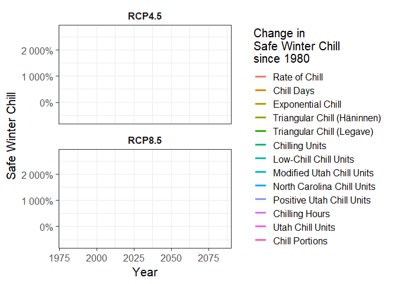

# Chill model comparison

## Perform a similar analysis for the location you’ve chosen for your exercises.

```{r, echo=FALSE, message=FALSE}
library(chillR)
require(devtools)
install_github("EduardoFernandezC/dormancyR")
library(dormancyR)
library(dplyr)
library(kableExtra)
coords <- c(18.8148, -33.9575)
```

In the first step, we rename all the chill metrics of the `dormancyR` package. And assign also names for the plotting.
```{r, renaming models and adding model labels}

hourly_models <- list(Chilling_units = chilling_units,
     Low_chill = low_chill_model,
     Modified_Utah = modified_utah_model,
     North_Carolina = north_carolina_model,
     Positive_Utah = positive_utah_model,
     Chilling_Hours = Chilling_Hours,
     Utah_Chill_Units = Utah_Model,
     Chill_Portions = Dynamic_Model)
daily_models<-list(Rate_of_Chill = rate_of_chill,
                   Chill_Days = chill_days,
                   Exponential_Chill = exponential_chill,
                   Triangula_Chill_Haninnen = triangular_chill_1,
                   Triangular_Chill_Legave = triangular_chill_2)

metrics<-c(names(daily_models),names(hourly_models))

model_labels=c("Rate of Chill",
               "Chill Days",
               "Exponential Chill",
               "Triangular Chill (Häninnen)",
               "Triangular Chill (Legave)",
               "Chilling Units",
               "Low-Chill Chill Units",
               "Modified Utah Chill Units",
               "North Carolina Chill Units",
               "Positive Utah Chill Units",
               "Chilling Hours",
               "Utah Chill Units",
               "Chill Portions")

```

```{r, echo=FALSE}
title <- "List with all Chill metrics"
data.frame(Metric=model_labels,'Function name'=metrics) %>% 
kbl(escape = F, format = "html", caption = title) %>%
  kable_paper("hover", full_width = T, position = "left")
```

In the next code chunk, we apply the whole list of chill metrics to all our past scenarios. And save our newly calculated data as `CapeTown_multichill_historic`

```{r create chill metrics for all past scenarios,  eval=FALSE}
CapeTown_temps<-read_tab("data/CapeTown_weather.csv")
Temps<-load_temperature_scenarios("data/Weather","CapeTown_historic")


Start_JDay<-121
End_JDay<-243

daily_models_past_scenarios<-tempResponse_list_daily(
  Temps,
  Start_JDay = Start_JDay,
  End_JDay = End_JDay,
  models=daily_models)
daily_models_past_scenarios<-lapply(
  daily_models_past_scenarios,
  function(x) x[which(x$Perc_complete>90),])
hourly_models_past_scenarios<-tempResponse_daily_list(
  Temps,
  latitude= coords[2],
  Start_JDay = Start_JDay,
  End_JDay = End_JDay,
  models=hourly_models,
  misstolerance = 10)

past_scenarios<-daily_models_past_scenarios
past_scenarios<-lapply(
  names(past_scenarios),
  function(x)
    cbind(past_scenarios[[x]],
          hourly_models_past_scenarios[[x]][,names(hourly_models)]))
names(past_scenarios)<-names(daily_models_past_scenarios)

daily_models_observed<-tempResponse_daily(
  CapeTown_temps,
  Start_JDay = Start_JDay,
  End_JDay = End_JDay,
  models=daily_models)
daily_models_observed<-
  daily_models_observed[which(daily_models_observed$Perc_complete>90),]
hourly_models_observed<-tempResponse_daily_list(
  CapeTown_temps,
  latitude= coords[2],
  Start_JDay = Start_JDay,
  End_JDay = End_JDay,
  models=hourly_models,
  misstolerance = 10)

past_observed<-cbind(
  daily_models_observed,
  hourly_models_observed[[1]][,names(hourly_models)])

save_temperature_scenarios(past_scenarios,
                           "data/chill",
                           "CapeTown_multichill_historic")
write.csv(past_observed,
          "data/chill/CapeTown_multichill_observed.csv",
          row.names=FALSE)
```

In the next code chunk, we apply the whole list of chill metrics to all our future scenarios. And save our newly calculated data in multiple files depending on their RCP and date.

```{r create chill metrics for all future scenarios, eval=FALSE}
RCPs<-c("rcp45","rcp85")
Times<-c(2050,2085)

for(RCP in RCPs)
  for(Time in Times)
    {
    Temps<-load_temperature_scenarios(
      "data/Weather",
      paste0("CapeTown_",Time,"_",RCP))

    daily_models_future_scenarios<-tempResponse_list_daily(
      Temps,
      Start_JDay = Start_JDay,
      End_JDay = End_JDay,
      models=daily_models)
    daily_models_future_scenarios<-lapply(
      daily_models_future_scenarios,
      function(x) x[which(x$Perc_complete>90),])
    hourly_models_future_scenarios<-
      tempResponse_daily_list(
        Temps,
        latitude= coords[2],
        Start_JDay = Start_JDay,
        End_JDay = End_JDay,
        models=hourly_models,
        misstolerance = 10)

    future_scenarios<-daily_models_future_scenarios
    future_scenarios<-lapply(
      names(future_scenarios),
      function(x)
        cbind(future_scenarios[[x]],
              hourly_models_future_scenarios[[x]][,names(hourly_models)]))
    names(future_scenarios)<-names(daily_models_future_scenarios)
    
    chill<-future_scenarios
    save_temperature_scenarios(
      chill,
      "data/chill",
      paste0("CapeTown_multichill_",Time,"_",RCP))
}
```

```{r, adapt the structure of the data, warning=FALSE, message=FALSE}
chill_past_scenarios<-load_temperature_scenarios(
  "data/chill",
  "CapeTown_multichill_historic")
chill_observed<-read_tab("data/chill/CapeTown_multichill_observed.csv")

chills <-make_climate_scenario(chill_past_scenarios,
                               caption = "Historic",
                               historic_data = chill_observed,
                               time_series = TRUE)
RCPs<-c("rcp45","rcp85")
Times<-c(2050,2085)

for(RCP in RCPs)
  for(Time in Times)
    {
    chill<-load_temperature_scenarios(
      "data/chill",
      paste0("CapeTown_multichill_",Time,"_",RCP))
    if(RCP=="rcp45") RCPcaption <- "RCP4.5"
    if(RCP=="rcp85") RCPcaption <- "RCP8.5"
    if(Time=="2050") Time_caption <- "2050"
    if(Time=="2085") Time_caption <- "2085"
    chills <-make_climate_scenario(chill,
                                   caption =c(RCPcaption,Time_caption),
                                   add_to = chills)
}
```

## Make a heat map illustrating past and future changes in Safe Winter Chill, relative to a past scenario, for the 13 chill models used here.

```{r prepare the dataset for plotting, warning=FALSE, message=FALSE}
for(i in 1:length(chills))
   {ch<-chills[[i]]
    if(ch$caption[1]=="Historic")
      {GCMs<-rep("none",length(names(ch$data)))
       RCPs<-rep("none",length(names(ch$data)))
       Years<-as.numeric(ch$labels)
       Scenario<-rep("Historic",length(names(ch$data)))} else
         {GCMs<-names(ch$data)
          RCPs<-rep(ch$caption[1],length(names(ch$data)))
          Years<-rep(as.numeric(ch$caption[2]),length(names(ch$data)))
          Scenario<-rep("Future",length(names(ch$data)))}
    for(nam in names(ch$data))
    {for(met in metrics)
      {temp_res<-data.frame(Metric=met,
                   GCM=GCMs[which(nam==names(ch$data))],
                   RCP=RCPs[which(nam==names(ch$data))],
                   Year=Years[which(nam==names(ch$data))],
                   Result=quantile(ch$data[[nam]][,met],0.1),
                   Scenario=Scenario[which(nam==names(ch$data))])
      if(i==1&nam==names(ch$data)[1]&met==metrics[1])
        results<-temp_res else
          results<-rbind(results,temp_res)
      results
    }}}
for(met in metrics)
  results[which(results$Metric==met),"SWC"]<-
    results[which(results$Metric==met),"Result"]/
      results[which(results$Metric==met&results$Year==1980),"Result"]-1
```

We first create a single heatmap for the SWC for all future scenarios together. After that we separate the plots by RCP and year with the `facet_grid()` function. To prepare the graph for the combination with the graph with data from the past, we need to adjust the size and apply some theme changes. Labels and an adjusted color map help for a better understanding.

```{r simple heatmap for SWC in future scenarios, warning=FALSE, message=FALSE}
require(ggplot2)
require(patchwork)
require(colorRamps)

rng = range(results$SWC)

p_future <- ggplot(results[which(!results$GCM=="none"),],
                 aes(GCM, y=factor(Metric, levels=metrics),
                     fill = SWC)) +
            geom_tile() +
            facet_grid(RCP ~ Year) +
            theme_bw(base_size = 15) +
            theme(axis.text = element_text(size=8)) +
            scale_fill_gradientn(colours=matlab.like(15),
                       labels = scales::percent,
                       limits=rng) +
            theme(axis.text.x = element_text(angle = 75,
                                             hjust = 1,
                                             vjust = 1)) +
            labs(fill = "Change in\nSafe Winter Chill\nsince 1980") +
            scale_y_discrete(labels=model_labels) +
            ylab("Chill metric")
```

We do a similar procedure for the past data by filtering it out with `GCM=="none"`.

```{r prepare past and future plots for combining, warning=FALSE, message=FALSE}
p_past<-
  ggplot(results[which(results$GCM=="none"),],
         aes(Year, y=factor(Metric, levels=metrics),
             fill = SWC)) +
  geom_tile()

p_past<-
  p_past +
  theme_bw(base_size = 15) +
  theme(axis.text = element_text(size=8)) +
  scale_fill_gradientn(colours=matlab.like(15),
                       labels = scales::percent,
                       limits=rng) +
  scale_x_continuous(position = "top") +
  labs(fill = "Change in\nSafe Winter Chill\nsince 1980") +
  scale_y_discrete(labels=model_labels) +
  ylab("Chill metric")
```

With the patchwork package, we can combine the previously created plots into one graph. With `nrow` we can determine the formation and with ´guides = "collect"´ we create only one legend for both plots.

```{r, warning=FALSE, message=FALSE , fig.cap='Heatmap for change in SWC for different chill metrics for the past and four future scenarios'}
chill_comp_plot <-
  (p_past + p_future +
     plot_layout(guides = "collect",nrow=2, heights=c(1,2))) &
  theme(plot.margin = margin(1, 1, 12, 1),
        legend.position = "right",
        strip.background = element_blank(),
        strip.text = element_text(face = "bold"))

chill_comp_plot
```

The plot shows the Safe Winter chill depending on different scenarios from the past and for the future. The best we can see in this plot is that the North Carolina Chill model should not be applied in South Africa. The model goes completely crazy and predicts changes of several thousand percent. This causes the problem that the scaling is also increasing and the predicted changes from the other models do not show up well.
I made another plot below where I this time filtered out the North Carolina model. A few models still show some peculiarities, but overall we can now see the results of the other models more clearly. The predictions of the models generally indicate a decrease in available chill. 

\
<div id="spoiler" style="display:none">

```{r, warning=FALSE, message=FALSE}
results_wo_North <- filter(results, !Metric=="North_Carolina")
rng = range(results_wo_North$SWC)


p_future2 <- ggplot(results_wo_North[which(!results_wo_North$GCM=="none"),],
                 aes(GCM, y=factor(Metric, levels=metrics[metrics!= "North_Carolina"]),
                     fill = SWC)) +
            geom_tile() +
            facet_grid(RCP ~ Year) +
            theme_bw(base_size = 15) +
            theme(axis.text = element_text(size=8)) +
            scale_fill_gradientn(colours=matlab.like(15),
                       labels = scales::percent,
                       limits=rng) +
            theme(axis.text.x = element_text(angle = 75,
                                             hjust = 1,
                                             vjust = 1)) +
            labs(fill = "Change in\nSafe Winter Chill\nsince 1980") +
            scale_y_discrete(labels=model_labels[model_labels!= "North Carolina Chill Units"]) +
            ylab("Chill metric")

p2_past <-
  ggplot(results_wo_North[which(results_wo_North$GCM=="none"),],
         aes(Year, y=factor(Metric, levels=metrics[metrics!= "North_Carolina"]),
             fill = SWC)) +
  geom_tile()

p2_past<-
  p2_past +
  theme_bw(base_size = 15) +
  theme(axis.text = element_text(size=8)) +
  scale_fill_gradientn(colours=matlab.like(15),
                       labels = scales::percent,
                       limits=rng) +
  scale_x_continuous(position = "top") +
  labs(fill = "Change in\nSafe Winter Chill\nsince 1980") +
  scale_y_discrete(labels=model_labels[model_labels!= "North Carolina Chill Units"]) +
  ylab("Chill metric")


chill_comp_plot2 <-
  (p2_past + p_future2 +
     plot_layout(guides = "collect",nrow=2, heights=c(1,2))) &
  theme(plot.margin = margin(1, 1, 12, 1),
        legend.position = "right",
        strip.background = element_blank(),
        strip.text = element_text(face = "bold"))
```

</div>

<button title="Click to show/hide the code for the new plot" type="button"
   onclick="if(document.getElementById('spoiler') .style.display=='none')
              {document.getElementById('spoiler') .style.display=''}
            else{document.getElementById('spoiler') .style.display='none'}">
  Show/Hide code
</button>
\


```{r, echo=FALSE, fig.cap='Adjusted heatmap for change in SWC for different chill metrics for the past and four future scenarios'}
results_wo_North <- filter(results, !Metric=="North_Carolina")
rng = range(results_wo_North$SWC)


p_future2 <- ggplot(results_wo_North[which(!results_wo_North$GCM=="none"),],
                 aes(GCM, y=factor(Metric, levels=metrics[metrics!= "North_Carolina"]),
                     fill = SWC)) +
            geom_tile() +
            facet_grid(RCP ~ Year) +
            theme_bw(base_size = 15) +
            theme(axis.text = element_text(size=8)) +
            scale_fill_gradientn(colours=matlab.like(15),
                       labels = scales::percent,
                       limits=rng) +
            theme(axis.text.x = element_text(angle = 75,
                                             hjust = 1,
                                             vjust = 1)) +
            labs(fill = "Change in\nSafe Winter Chill\nsince 1980") +
            scale_y_discrete(labels=model_labels[model_labels!= "North Carolina Chill Units"]) +
            ylab("Chill metric")

p2_past <-
  ggplot(results_wo_North[which(results_wo_North$GCM=="none"),],
         aes(Year, y=factor(Metric, levels=metrics[metrics!= "North_Carolina"]),
             fill = SWC)) +
  geom_tile()

p2_past<-
  p2_past +
  theme_bw(base_size = 15) +
  theme(axis.text = element_text(size=8)) +
  scale_fill_gradientn(colours=matlab.like(15),
                       labels = scales::percent,
                       limits=rng) +
  scale_x_continuous(position = "top") +
  labs(fill = "Change in\nSafe Winter Chill\nsince 1980") +
  scale_y_discrete(labels=model_labels[model_labels!= "North Carolina Chill Units"]) +
  ylab("Chill metric")


chill_comp_plot2 <-
  (p2_past + p_future2 +
     plot_layout(guides = "collect",nrow=2, heights=c(1,2))) &
  theme(plot.margin = margin(1, 1, 12, 1),
        legend.position = "right",
        strip.background = element_blank(),
        strip.text = element_text(face = "bold"))

chill_comp_plot2

```

## Produce an animated line plot of your results (summarizing Safe Winter Chill across all the GCMs).

The animated plot is based on a line plot, that was animated with `transition_reveal(Year)` from the `gganimate` package. The line plot is revealed in order of the ´Year´ variable. Instead of plotting the graph directly in the markdown document, I decided to save it as a file and import it. This allowed me to knit the document faster.

```{r data preparation for line graph arrangement, warning=FALSE, message=FALSE}
hist_results<-results[which(results$GCM=="none"),]
hist_results$RCP<-"RCP4.5"
hist_results_2<-hist_results
hist_results_2$RCP<-"RCP8.5"
hist_results<-rbind(hist_results,hist_results_2)
future_results<-results[which(!results$GCM=="none"),]

GCM_aggregate<-aggregate(
  future_results$SWC,
  by=list(future_results$Metric,future_results$RCP,future_results$Year),
  FUN=mean)
colnames(GCM_aggregate)<-c("Metric","RCP","Year","SWC")

RCP_Time_series<-rbind(hist_results[,c("Metric","RCP","Year","SWC")],
                       GCM_aggregate)
```

```{r createing the plot for chill_change as line plot, warning=FALSE, message=FALSE}
chill_change_plot <-
  ggplot(data=RCP_Time_series,
         aes(x=Year,y=SWC,col=factor(Metric,levels=metrics))) +
  geom_line(lwd=1.3) +
  facet_wrap(~RCP,nrow=2) +
  theme_bw(base_size=15) +
  labs(col = "Change in\nSafe Winter Chill\nsince 1980") +
  scale_color_discrete(labels=model_labels) +
  scale_y_continuous(labels = scales::percent) +
  theme(strip.background = element_blank(),
        strip.text = element_text(face = "bold")) +
  ylab("Safe Winter Chill")
```

```{r using gganimate to animate chill_change plot, warning=FALSE, message=FALSE, eval=FALSE}
library(gganimate)
library(gifski)

myPlot <- chill_change_plot + transition_reveal(Year)

animate(myPlot, renderer = gifski_renderer())
anim_save("plots/chill_comparison_animation.gif", animation = last_animation())
```

The line plot also shows again clearly that the North Carolina Chill model is not suitable for South Africa. For the other models, we can see that the SWC will decrease.

```{r, echo=FALSE, out.width="100%", fig.cap='Animated line plot for the change in SWC depending on different chill models for Cape Town, South Africa since 1980'}

```


\
<hr />