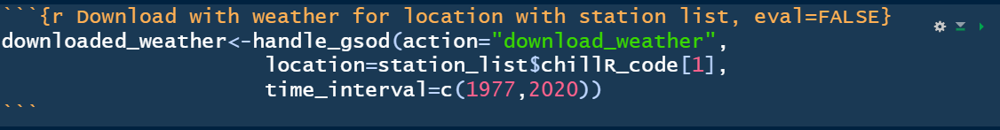

--- 
title: "Tree phenology analysis with R - Logbook"
author: "Julian Bauer"
site: bookdown::bookdown_site
documentclass: book
bibliography: [book.bib, packages.bib]
description: |
  The logbook for the Tree phenology analysis with R logbook
link-citations: yes
github-repo: rstudio/bookdown-demo
always_allow_html: true
---

# About

Placeholder


<!--chapter:end:index.Rmd-->

# Tools

## Organization

### Bookdown
I chose the markdown+bookdown approach for a better organization

## Packages

### chillR

### dplyr family

### ggplot2

### plotly

### leaflet


<!--chapter:end:02-tools.Rmd-->

# Tree dormancy

## Put yourself in the place of a breeder who wants to calculate the temperature requirements of a newly released cultivar. Which method will you use to calculate the chilling and forcing periods? Please justify your answer.

At the moment the Dynamic model is the most sophisticated approach, because of its process based idea. This leads on the other hand to more complicated calculations compared to prior methods . Models like the chilling hours are easier to calculate, but do not longer meet the needed requirements. I would recommend the breeder to use the Dynamic model, because of its high reliability. The temperature as only input is the same for all models.


## Which are the advantages (2) of the BBCH scale compared with earlies scales?

-   covers the whole development of the plant not only the buds as with earlier scales
-   developed in a way that it can suited to all plant species numerical order is more comprehensive


## Classify the following phenological stages of sweet cherry according to the BBCH scale:**

1.  54/55

2.  65 could be also lower if the object in the background is a (closed) bud

3.  89\
    \

    <hr />

<!--chapter:end:03-tree_dormancy.Rmd-->


# Climate change and impact projection

Placeholder


## List the main drivers of climate change at the decade to century scale, and briefly explain the mechanism through which the currently most important driver affects our climate.
## Explain briefly what is special about temperature dynamics of the recent decades, and why we have good reasons to be concerned.
## What does the abbreviation 'RCP' stand for, how are RCPs defined, and what is their role in projecting future climates?
## Briefly describe the 4 climate impact projection methods described in the fourth video.

<!--chapter:end:04-climate_change.Rmd-->

# Winter chill projections

## Sketch out three data access and processing challenges that had to be overcome in order to produce chill projections with state-of-the-art methodology.

-   Climate data can easily accumulate to high amounts of computer data, which can make further processing highly demanding in time and computing. But good data management and increasingly efficient computers enable tasks like this.
-   Over time, various climate models were created and replaced with improved ones, after new insights were gathered. The changes from SRESs to SSPs and later to RCPs increased the quality of the forecasts, but for users of those forecasts it meant adapting to the new standard.
-   To achieve state-of-the-art chill projections, so called ensembles are used. These consist of several chilling models plotted together. The idea is, that there is no single correct model, but multiple models that represent the chill projections.


## Outline, in your understanding, the basic steps that are necessary to make such projections.

-   setting the spatial scope for the projections
-   setting the temporal scope for the projections
-   choosing the ensemble of chill models
-   accessing the data from the past
-   prepare the data
-   generating the data for the future climate with a weather generator
-   apply the ensemble of chill models
-   plot the results

\
<hr />

<!--chapter:end:05-chill_projections.Rmd-->


# Manual chill analysis

Placeholder


## Write a basic function that calculates warm hours (\>25°C)
## Apply this function to the Winters_hours_gaps dataset
## Extend this function, so that it can take start and end dates as inputs and sums up warm hours between these dates

<!--chapter:end:06-manual_chill_analysis.Rmd-->


# Chill Models

Placeholder


<!--chapter:end:07-chill_models.Rmd-->


# Making hourly temperatures

Placeholder


<!--chapter:end:08-making_hourly_temp.Rmd-->


# Getting temperature data

Placeholder


## Choose a location of interest and find the 25 closest weather stations using the handle_gsod function
## Download weather data for the most promising station on the list
## Convert the weather data into chillR format

<!--chapter:end:09-getting_temp_data.Rmd-->


# Filling gaps in temperature records

Placeholder


## Use chillR functions to find out how many gaps you have in this dataset (even if you have none, please still follow all further steps)
## Create a list of the 25 closest weather stations using the handle_gsod function
## Identify suitable weather stations for patching gaps
## Download weather data for promising stations, convert them to chillR format and compile them in a list
## Use the patch_daily_temperatures function to fill gaps
## Investigate the results - have all gaps been filled?
## If necessary, repeat until you have a dataset you can work with in further analyses

<!--chapter:end:10-filling_gaps.Rmd-->


# Generating temperature scenarios

Placeholder


## For the location you chose for your earlier analyses, use chillR’s weather generator to produce 100 years of synthetic temperature data.
## Calculate winter chill (in Chill Portions) for your synthetic weather, and illustrate your results as histograms and cumulative distributions.
## Produce similar plots for the number of freezing hours (<0°C) in April (or October, if your site is in the Southern Hemisphere) for your location of interest.

<!--chapter:end:11-generating_temp_scenarios.Rmd-->

# Saving and Loading Data

The chapter conveyed some important tips to reduce the knitting and processing time for the Markdown files with chunk attributes like `echo=FALSE` and `eval=FALSE`. We are able to hide some parts of our code or show code to the reader, without executing it in the background.

<hr />

<!--chapter:end:12-saving_loading_data.Rmd-->


# Historic temperature scenarios

Placeholder


## For the location you chose for previous exercises, produce historic temperature scenarios representing several years of the historic record (your choice).
## Produce chill distributions for these scenarios and plot them.

<!--chapter:end:13-historic_scenarios.Rmd-->


# Future temperature scenarios

Placeholder


## Analyze the historic and future impact of climate change on three agroclimatic metrics of your choice, for the location you’ve chosen for your earlier analyses.

<!--chapter:end:14-future_scenarios.Rmd-->


# Plotting future scenarios

Placeholder


## Produce similar plots for the weather station you selected for earlier exercises.

<!--chapter:end:15_plotting_future_scenarios.Rmd-->


# Chill model comparison

Placeholder


## Perform a similar analysis for the location you’ve chosen for your exercises.
## Make a heat map illustrating past and future changes in Safe Winter Chill, relative to a past scenario, for the 13 chill models used here.
## Produce an animated line plot of your results (summarizing Safe Winter Chill across all the GCMs).

<!--chapter:end:16-chill_model_comparison.Rmd-->

# Chill model comparison

## Provide a brief narrative describing what p-hacking is, and why this is a problematic approach to data analysis.{.tabset}

### Answer{.active}
P-hacking is the term used when scientists artificially represent their results in a significant way. Large data sets always contain significant structures. By data analysis and there especially often by machine learning methods such correlations are specifically searched for, although they have no relevance for the actual application. Therefore, it is important to understand the data in the context of its origin and its natural process.

### Cartoon

## {-}

## Provide a sketch of your causal understanding of the relationship between temperature and bloom dates.


## What do we need to know to build a process-based model from this?

<!--chapter:end:17-simple_phenology_analysis.Rmd-->


# Delineating temperature response phases with PLS regression

Placeholder


## Briefly explain why you shouldn’t take the results of a PLS regression analysis between temperature and phenology at face value. What do you need in addition in order to make sense of such outputs?
## Replicate the PLS analysis for the Roter Boskoop dataset that you used in a previous lesson.
## Write down your thoughts on why we’re not seeing the temperature response pattern we may have expected. What happened to the chill response?

<!--chapter:end:18-pls_delineating_temp_phases.Rmd-->


# Successes and limitations of PLS regression analysis

Placeholder


## Briefly explain in what climatic settings we can expect PLS regression to detect the chilling phase - and in what settings this probably won’t work.
## How could we overcome this problem?

<!--chapter:end:19-pls_successes_and_limits.Rmd-->


# PLS regression with agroclimatic metrics

Placeholder


## Repeat the PLS_chill_force procedure for the ‘Roter Boskoop’ dataset. Include plots of daily chill and heat accumulation.
## Run PLS_chill_force analyses for all three major chill models. Delineate your best estimates of chilling and forcing phases for all of them.
## Plot results for all three analyses, including shaded plot areas for the chilling and forcing periods you estimated.

<!--chapter:end:20-pls_with_agroclimatic_metrics.Rmd-->

# Examples of PLS regression with agroclimatic metrics
\

## Look across all the PLS results presented above. Can you detect a pattern in where chilling and forcing periods could be delineated clearly, and where this attempt failed?.

We can see that some of the PLS results can be easier delineated. The PLS analysis on Chinese data, showed no clear dormancy phases. There were some peaks, which could be assigned to the chilling or forcing period, but on the other side some contradictory coefficients were also seen, especially during the endodormancy. During the ecodormancy the results could be assigned easier and also in a more uniform way. Similar results can we also see in Germany, the UK and also Croatia. In countries like Tunisia or regions like California, we can see that the two phases can be recognized easier. The average temperature during winter and summer is lower in countries like China or Germany compared to Tunisia or California. Croatia is in between regarding there temperatures, but the PLS analysis do not show clear results.

\
## Can you think about possible reasons for the success or failure of PLS analysis based on agroclimatic metrics (if so, write down your thoughts)?
The PLS-analysis is based on variation in the data. This means that if our PLS analysis does not result in clear observations, one reason could be low variation in the data. In the next chapter, we can see how the data of the well performing countries is distributed in comparison to the chill model sensitivity. The data from these regions shows variation and is spread about areas of the functions, where chill is generated, but also on parts where chill is not generated, due to high temperatures. 


<!--chapter:end:21-examples_of_pls.Rmd-->


# Why PLS doesn’t always work

Placeholder


## Produce chill and heat model sensitivity plots for the location you focused on in previous exercises.
## Look at the plots for the agroclimate-based PLS analyses of the ‘Alexander Lucas’ and ‘Roter Boskoop’ datasets. Provide your best estimates of the chilling and forcing phases.

<!--chapter:end:22-why_PLS_not_always_works.Rmd-->


# Evaluating PLS outputs

Placeholder


## Reproduce the analysis for the ‘Roter Boskoop’ dataset.
## We’ve looked at data from a number of locations so far. How would you expect this surface plot to look like in Beijing? And how should it look in Tunisia?

<!--chapter:end:23-pls_evaluation.Rmd-->

# The relative importance of chill and heat


## Describe the temperature response hypothesis outlined in this chapter.

The phenology temperature response hypothesis addresses how different climate in various regions affects the impact of the chilling and forcing period during the dormancy. In cold regions such as China or Germany, where chill is sufficient the temperatures of the forcing period determine the blossom development almost exclusively. The driver of the phenology development is the forcing phase. In warm regions such as Tunisia, where heat is abundant the temperatures in the chilling period determine the duration of dormancy. In these regions the driver for development is mainly the chilling. The cases where the length of dormancy is influenced by only almost one of the two phases are the most extreme cases. They represent the two ends of the spectrum of the temperature influence of the dormancy. In between there is a gradient in which both phases can have a substitutable influence.


<!--chapter:end:24-importance_chill_heat.Rmd-->

# Making valid tree phenology models


## Explain the difference between output validation and process validation.

The complicated processes in nature have often resulted in output validated models. In this case, only the model output is compared with real observations. The way in which this output has been generated is not further elucidated. Such output validated models are often based on machine learning methods like regression, neural networks or random forest approaches. The goal is to use the training data to create a model that gives a suitable output. With output validated models, good performance has little to do with an accurate model.

Process validated models, on the other hand, aim to capture the real process behind the output. In order to be successful, certain mechanics must be known that contribute to the output result in nature. The models must therefore also be reviewed in the light of new research findings. In process validated models it is an important to model natural phenomena accurately without getting lost in too detailed approaches. In terms of phenology models, a process validated model should additionally be able to explain special events such as Saint Barbara cherry blossoms or other tree related flowering anecdotes.

## Explain what a validity domain is and why it is important to consider this whenever we want to use our model to forecast something.

The validity domain is the area of a model in which it can make reliable statements. Models can often make statements outside of their validity domain. However, it is important to recognize this and be cautious when necessary. The validity domain is often influenced by the model or the data it was calibrated on. If the calibration data are in a certain range, the validity domain covers to some extent only this range.
This is especially important when making predictions about future events. Often the input data will be different in the future than it was in the past. Models trained only on past data have a validity domain that would not include future data. This leads to model results that are not credible. The model will still produce results, but since the validity domain has been exceeded, they are likely to be flawed.


## What is validation for purpose?

Validation for purpose considers whether a model is suitable for the actual application. Which features are part of the model and how exactly can a model fulfill its intention. If the model is validated for the wrong purpose, errors can occur during its later use.


## How can we ensure that our model is suitable for the predictions we want to make?

Regarding the validity domain, we need to check if the test data overlaps substantially with the data the model was calibrated on. If this is not the case, a possible option would be to increase the validity domain by adding artificially created data to the calibration.


<!--chapter:end:26-making_valid_pheno_models.Rmd-->


# The PhenoFlex model

Placeholder


## Parameterize the PhenoFlex model for `Roter Boskoop’ apples.
## Produce plots of predicted vs. observed bloom dates and distribution of prediction errors.
## Compute the model performance metrics RMSEP, RPIQ, mean error and mean absolute error.

<!--chapter:end:27-phenoflex.Rmd-->


# The PhenoFlex model - a second look

Placeholder


## Make chill and heat response plots for the ‘Alexander Lucas’ PhenoFlex model for the location you did the earlier analyses for.

<!--chapter:end:28-phenoflex_second_lookv2.Rmd-->

# Can we improve the performance of PhenoFlex?


```{r, echo=FALSE}
#https://www.researchgate.net/publication/360936074_Unusually_warm_winter_seasons_may_compromise_the_performance_of_current_phenology_models_-_Predicting_bloom_dates_in_young_apple_trees_with_PhenoFlex
```

## What was the objective of this work?

The objective of this work was to apply data from earlier collected experimental seasons to the PhenoFlex model.
The main part of this was to calibrate the PhenoFlex model with normal phenology data and with data that additionally contained also 5 marginal phenology records. This helped to show the impact of the marginal seasons on the performance of the PhenoFlex model.


## What was the main conclusion?

The main conclusion is that the model whose calibration also contained the marginal data has a lower performance compared to the calibration without the warm seasons. One possible hypothesis for the decline in model performance is that the bloom in the marginal season occurred through alternative mechanisms compared to the regular chill force process. These alternative mechanisms are not considered by the model. Therefore data outside the validity range can negatively affect the model parameters. 


## What experiments could we conduct to test the hypothesis that emerged at the end of the conclusion?

Flowering can be triggered not only by sufficient chill during the chilling phase and heat during the forcing phase, but also by other partly stress-related mechanisms. Producers in growing regions with insufficient chill for example use chemicals that induce stress which eventually can also lead to flowering in trees. In an experiment plant hormones or gene regulation connected to stress could be measured at trees under different climate conditions. Under marginal conditions such stress levels could be increased, which would support the hypothesis that the blossom in marginal seasons is induced by stress for example.


<!--chapter:end:29-phenoflex_improve_performance.Rmd-->


# Frost risk analysis

Placeholder


## Download the phenology dataset for the apple cultivar Roter Boskoop from Klein-Altendorf.
## Illustrate the development of the bloom period over the duration of the weather record. Use multiple ways to show this - feel free to be creative.
## Evaluate the occurrence of frost events at Klein-Altendorf since 1958. Illustrate this in a plot.
## Produce an illustration of the relationship between spring frost events and the bloom period of ‘Roter Boskoop.’
## Evaluate how the risk of spring frost for this cultivar has changed over time. Has there been a significant trend?

<!--chapter:end:30-frost_risk_analysis.Rmd-->

