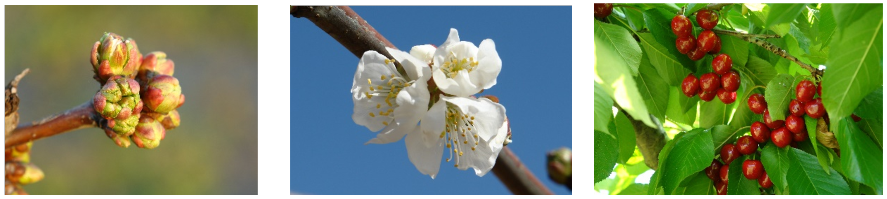

```{r setup, include=FALSE}
knitr::opts_chunk$set(echo = TRUE)
```

# Learning Logbook

```{r}
plot(pressure)
```


## Lesson 03: Tree dormancy

Put yourself in the place of a breeder who wants to calculate the temperature requirements of a newly released cultivar. Which method will you use to calculate the chilling and forcing periods? Please justify your answer.




Which are the advantages (2) of the BBCH scale compared with earlies scales?

Classify the following phenological stages of sweet cherry according to the BBCH scale:

